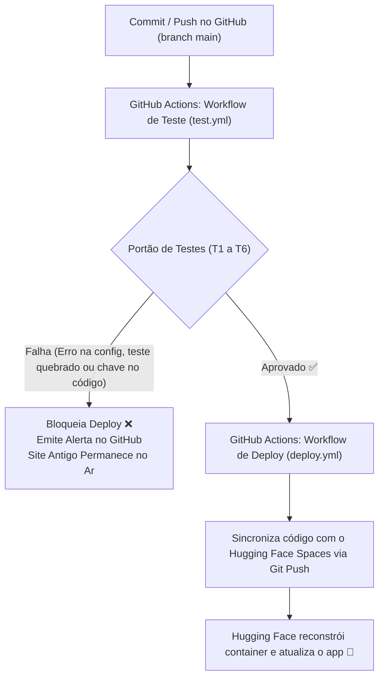

# SPEC-parte1-cicd-deploy.md: Especificação Técnica e Pipeline de Deploy (Parte 1)

> **Projeto**: Assistente Educacional de Engenharia de Dados & IA  
> **Status**: Proposta aguardando aprovação  
> **Autor**: Ramon Barbosa  
> **Repositório GitHub**: `ramonbarrbosa/agente_teste`  
> **Hugging Face Space**: `ramonbarrbosa/agente-teste`  
> **Data**: Setembro de 2026  

---

## 1. Objetivo, Público e Escopo

### 1.1 Objetivo
Disponibilizar na internet um assistente de inteligência artificial em formato de chat web interativo, com alta disponibilidade e custo previsível, focado em tirar dúvidas de alunos sobre **Engenharia de Dados e Inteligência Artificial**. O assistente deve ser completamente personalizável via um único arquivo de configuração (`config.yaml`), sem necessidade de tocar em código Python, e implantado de forma automatizada no Hugging Face Spaces através do GitHub Actions.

### 1.2 Público-Alvo
- **Alunos e estudantes** de tecnologia que buscam explicações didáticas, exemplos práticos de código (SQL, Python, pipelines, modelagem) e conceitos claros de IA.
- **Mantenedor do projeto (Ramon Barbosa)**, que deseja alterar instruções pedagógicas, modelos de IA, perguntas de exemplo e estilo visual diretamente pelo editor web do GitHub, com publicação segura e automática.

### 1.3 Divisão de Escopo

| O que ENTRA na Parte 1 (Este Documento) | O que FICA para a Parte 2 | O que FICA para a Parte 3 |
| :--- | :--- | :--- |
| Interface web de chat moderna e responsiva (Gradio). | Base de conhecimento própria (RAG com PDFs, apostilas e notas de aula). | Site próprio com domínio customizado e frontend independente. |
| Suporte resiliente a 3 provedores: **OpenRouter**, **OpenAI** e **Anthropic**. | Banco de dados vetorial (ChromaDB / Qdrant) para busca semântica. | Sistema de login e autenticação de usuários (OAuth/Google/GitHub). |
| Troca automática de provedor (failover) em caso de erro, cota esgotada ou indisponibilidade. | Citação explícita das fontes e trechos de apostilas nas respostas. | Histórico de conversas salvo em banco relacional (PostgreSQL). |
| Configuração centralizada em arquivo único `config.yaml`. | Avaliação da qualidade das respostas do RAG (Ragas/TruLens). | Painel administrativo com métricas de uso e custos por aluno. |
| Pipeline de CI/CD automatizado via GitHub Actions com portão de testes. | | |
| Detecção de vazamento acidental de chaves de API no commit. | | |
| Deploy contínuo e gratuito no Hugging Face Spaces (CPU Basic). | | |

---

## 2. Stack Escolhida e Restrições da Infraestrutura

### 2.1 Tecnologias e SDKs

1. **Linguagem & Ambiente**:
   - **Python 3.10+**: Estável, compatível com o ecossistema Hugging Face Spaces.
2. **Interface Visual**:
   - **Gradio 4.x / 5.x**: Escolhido por ser o framework nativo do Hugging Face Spaces, permitindo interface de chat rápida, suporte a temas customizados, injeção de CSS leve, botões de exemplos e renderização perfeita em celulares e computadores.
3. **Comunicação com Modelos de IA**:
   - **Anthropic SDK oficial (`anthropic`)**: Para modelos Claude (ex: `claude-3-5-haiku-latest`).
   - **OpenAI SDK oficial (`openai`)**: Usado para dois provedores:
     - **OpenAI**: Chamada padrão aos modelos (ex: `gpt-4o-mini`).
     - **OpenRouter**: Mesma biblioteca `openai`, configurando `base_url="https://openrouter.ai/api/v1"` para acessar modelos variados e gratuitos (ex: `google/gemma-4-31b-it:free`).
4. **Validação & Parsing de Configuração**:
   - **PyYAML** + **Pydantic v2**: Garante que qualquer erro no arquivo `config.yaml` seja detectado antes da execução, impedindo que o app quebre em produção.
5. **Automação & Qualidade**:
   - **Pytest**: Bateria de testes unitários automatizados com mocks (sem gastar créditos de API nos testes).
   - **GitHub Actions**: Orquestrador de integração contínua (CI) e entrega contínua (CD).

### 2.2 Estratégia de Chaves de API e Failover
- **Isolamento Total**: Nenhuma chave de API fica salva em código ou arquivos do repositório. As chaves residem exclusivamente como **Secrets** no Hugging Face Spaces:
  - `OPENROUTER_API_KEY`
  - `ANTHROPIC_API_KEY`
  - `OPENAI_API_KEY`
- **Operação Parcial Suportada**: O app funciona mesmo se apenas **uma** chave estiver cadastrada.
- **Failover em Cascata**: Ao receber uma mensagem do usuário, o sistema:
  1. Filtra os provedores listados em `provider_priority` que possuem chave de API presente no ambiente.
  2. Tenta o primeiro provedor configurado.
  3. Se houver falha de rede, timeout, erro 429 (limite/cota excedida) ou erro 500/503 (serviço fora do ar), captura a exceção e tenta imediatamente o próximo provedor.
  4. Se **todos** os provedores falharem (ou se nenhuma chave estiver configurada), apresenta uma mensagem amigável no chat listando o motivo de cada falha.

### 2.3 Restrições Conhecidas do Hugging Face Spaces (CPU Basic)
- **Hardware Gratuito**: 2 vCPUs e 16 GB de RAM. Como não rodamos modelos pesados localmente (apenas chamadas HTTP para APIs externas), o consumo de memória é mínimo (< 300 MB), sendo mais que suficiente.
- **Hibernação por Inatividade**: O Space gratuito entra em modo de suspensão após 48 horas sem acessos. Ao receber uma nova visita, pode ocorrer um atraso de inicialização (*cold start*) de 30 a 60 segundos.
- **Porta Obrigatória**: O servidor interno deve escutar impreterivelmente na porta `7860` (`server_name="0.0.0.0"`, `server_port=7860`).
- **Sistema de Arquivos Efêmero**: Qualquer arquivo temporário gerado em tempo de execução é descartado ao reiniciar o container. Toda configuração deve vir do repositório Git ou das variáveis de ambiente.

---

## 3. Estrutura de Arquivos do Projeto

```
agente_teste/
├── .github/
│   └── workflows/
│       ├── test.yml            # CI: Portão de testes, validação de config e checagem de segurança
│       └── deploy.yml          # CD: Sincronização automática para o Hugging Face Spaces
├── assets/
│   └── logo.png                # Imagem do logotipo do assistente (usada no topo do chat)
├── src/
│   ├── __init__.py
│   ├── config.py               # Modelo Pydantic e leitura segura do config.yaml
│   ├── providers/
│   │   ├── __init__.py
│   │   ├── base.py             # Classe abstrata e estrutura padrão de resposta/erro
│   │   ├── openrouter.py       # Integração OpenRouter via SDK openai (base_url customizada)
│   │   ├── openai_client.py    # Integração OpenAI via SDK openai
│   │   ├── anthropic_client.py # Integração Anthropic via SDK anthropic
│   │   └── router.py           # Mecanismo de failover inteligente em cascata
│   └── ui.py                   # Interface Gradio (layout, componentes, tema e botões de exemplo)
├── tests/
│   ├── __init__.py
│   ├── test_config.py          # Testes do validador de configuração
│   ├── test_providers.py       # Testes unitários com mocks dos 3 clientes de IA
│   ├── test_router.py          # Teste de failover (sucesso no 2º provedor após falha do 1º)
│   └── test_security.py        # Teste de segurança contra vazamento de chaves no repositório
├── config.yaml                 # Arquivo central de personalização (editável pelo GitHub)
├── app.py                      # Ponto de entrada da aplicação (carrega config, router e sobe Gradio)
├── requirements.txt            # Dependências mínimas de produção para o Hugging Face
├── requirements-dev.txt        # Dependências adicionais para rodar testes e lint localmente
├── .gitignore                  # Arquivos e pastas ignorados pelo Git (.env, cache, venv)
├── README.md                   # Metadados do Space (frontmatter YAML) e documentação
└── IDEIA-parte1.md             # Documento de concepção inicial do projeto
```

---

## 4. Contrato do Arquivo de Configuração (`config.yaml`)

O arquivo `config.yaml` é a única fonte da verdade para o comportamento e o visual do assistente. Abaixo está o contrato estrito de cada campo:

| Seção | Campo | Obrigatório? | Tipo | Valores Aceitos / Regras | Valor Padrão |
| :--- | :--- | :---: | :--- | :--- | :--- |
| `assistant` | `name` | Sim | `string` | De 3 a 60 caracteres. | `"Prof. Ada - Engenharia de Dados & IA"` |
| `assistant` | `description` | Sim | `string` | De 10 a 300 caracteres. | `"Assistente didático para dúvidas sobre SQL, pipelines e Inteligência Artificial."` |
| `assistant` | `system_prompt` | Sim | `string` | Texto livre com a persona, tom e restrições. | *(Prompt de professor didático)* |
| `ui` | `primary_color` | Sim | `string` | Código hexadecimal válido (`^#[0-9a-fA-F]{6}$`). | `"#2563EB"` (Azul vibrante) |
| `ui` | `secondary_color` | Sim | `string` | Código hexadecimal válido (`^#[0-9a-fA-F]{6}$`). | `"#1E293B"` (Cinza chumbo) |
| `ui` | `logo_path` | Sim | `string` | Caminho relativo para arquivo `.png`, `.jpg` ou `.svg` existente. | `"assets/logo.png"` |
| `ui` | `logo_width` | Não | `integer`| Número inteiro entre 32 e 300 pixels. | `80` |
| `ui` | `examples` | Sim | `list[str]` | Lista contendo entre 1 e 6 perguntas curtas. | *(Perguntas de exemplo)* |
| `llm` | `max_tokens` | Não | `integer`| Número inteiro entre 128 e 4096. | `1024` |
| `llm` | `temperature` | Não | `float`  | Número decimal entre 0.0 e 1.0. | `0.7` |
| `llm` | `provider_priority` | Sim | `list[str]` | Lista com os nomes dos provedores na ordem desejada. Itens aceitos: `openrouter`, `openai`, `anthropic`. | `["openrouter", "openai", "anthropic"]` |
| `llm.providers.openrouter` | `model` | Sim | `string` | Nome válido de modelo OpenRouter. | `"google/gemma-4-31b-it:free"` |
| `llm.providers.openai` | `model` | Sim | `string` | Nome válido de modelo OpenAI. | `"gpt-4o-mini"` |
| `llm.providers.anthropic` | `model` | Sim | `string` | Nome válido de modelo Anthropic. | `"claude-3-5-haiku-latest"` |

### Exemplo Completo de `config.yaml`:
```yaml
assistant:
  name: "Prof. Ada - Engenharia de Dados & IA"
  description: "Assistente didático para dúvidas sobre SQL, pipelines e Inteligência Artificial."
  system_prompt: >
    Você é a Professora Ada, uma tutora especialista e acolhedora em Engenharia de Dados e IA.
    Seu objetivo é explicar conceitos complexos com metáforas simples, código claro e boas práticas.
    Regras estritas:
    1. Sempre responda em português brasileiro fluente e didático.
    2. Nunca invente bibliotecas ou dados fictícios.
    3. Quando o aluno trouxer um erro de código, explique a causa raiz antes de dar a solução corrigida.
    4. Mantenha as respostas concisas e estimule o aluno a pensar criticamente.

ui:
  primary_color: "#2563EB"
  secondary_color: "#1E293B"
  logo_path: "assets/logo.png"
  logo_width: 80
  examples:
    - "Qual a diferença prática entre Data Lakehouse e Data Warehouse?"
    - "Como funciona o comando MERGE no SQL e quando devo usá-lo?"
    - "Explique o que é RAG (Retrieval-Augmented Generation) de forma simples."
    - "Como otimizar uma consulta pesada que faz múltiplos joins?"

llm:
  max_tokens: 1024
  temperature: 0.7
  provider_priority:
    - "openrouter"
    - "openai"
    - "anthropic"
  providers:
    openrouter:
      model: "google/gemma-4-31b-it:free"
    openai:
      model: "gpt-4o-mini"
    anthropic:
      model: "claude-3-5-haiku-latest"
```

---

## 5. Requisitos Funcionais Numerados

- **RF1 - Inicialização Tolerante a Chaves Faltantes**: O aplicativo deve inicializar normalmente se pelo menos uma das chaves (`OPENROUTER_API_KEY`, `ANTHROPIC_API_KEY`, `OPENAI_API_KEY`) estiver presente. Se nenhuma chave estiver configurada, o app sobe em modo de alerta, instruindo o administrador a cadastrar os secrets.
- **RF2 - Cascata Automática de Provedores (Failover)**: Durante uma pergunta do usuário, o sistema deve iterar sobre a lista `provider_priority` considerando apenas provedores com credenciais ativas. Caso um provedor retorne erro HTTP (ex: 429, 401, 500, 503) ou timeout, o sistema deve acionar silenciosamente o provedor subsequente.
- **RF3 - Diagnóstico Amigável em Caso de Esgotamento Total**: Se todos os provedores falharem sucessivamente, o chat deve responder com uma mensagem amigável em português, contendo a lista dos provedores tentados e a causa simplificada de cada falha (ex: `OpenRouter: Limite de requisições excedido (429) | OpenAI: Saldo insuficiente`).
- **RF4 - Configuração Dinâmica Sem Código**: Todas as alterações visuais (cores, textos, logotipo) e lógicas (ordem de prioridade, modelos, system prompt) devem ser lidas diretamente do `config.yaml`.
- **RF5 - Interface Responsiva com Gradio**: A tela deve exibir no cabeçalho o logotipo redimensionado, o nome do assistente e a descrição. Abaixo, o componente de chat com botões de perguntas sugeridas configuradas em `ui.examples`.
- **RF6 - Suporte aos SDKs Oficiais**:
  - Provedor Anthropic deve utilizar `anthropic.Anthropic`.
  - Provedor OpenAI deve utilizar `openai.OpenAI`.
  - Provedor OpenRouter deve utilizar `openai.OpenAI(base_url="https://openrouter.ai/api/v1", api_key=...)`.
- **RF7 - Sanitização e Segurança**: As chaves de API e mensagens brutas de erro de stacktrace com dados sensíveis nunca devem ser expostas na interface pública do chat.

---

## 6. Verificações do Portão de Testes Numeradas

O portão de testes (CI) roda automaticamente antes de qualquer tentativa de publicação. Se qualquer verificação falhar, o deploy é cancelado imediatamente.

- **T1 - Validação Sintática e Semântica do `config.yaml`**:
  - Verifica se o arquivo YAML é válido e legível.
  - Valida se os campos obrigatórios estão preenchidos.
  - Valida se as cores `primary_color` e `secondary_color` seguem o padrão hexadecimal `#RRGGBB`.
  - Valida se o arquivo apontado em `logo_path` existe fisicamente no repositório.
  - Valida se `provider_priority` contém apenas os provedores permitidos (`openrouter`, `openai`, `anthropic`).
- **T2 - Varredura de Prevenção de Vazamento de Segredos (Secret Leak Guard)**:
  - Varre todos os arquivos do repositório em busca de padrões de chaves de API conhecidas:
    - Anthropic: `sk-ant-[a-zA-Z0-9_\-]{20,}`
    - OpenAI / OpenRouter: `sk-[a-zA-Z0-9_\-]{20,}`
  - Falha o build imediatamente se alguma chave for detectada em texto puro no código ou na configuração.
- **T3 - Teste Unitário dos Clientes de Provedores com Mock**:
  - Testa individualmente os adaptadores `OpenRouterClient`, `OpenAIClient` e `AnthropicClient` usando respostas simuladas (mocks), garantindo que os parâmetros `model`, `max_tokens` e `messages` são enviados corretamente.
- **T4 - Teste de Failover em Cascata**:
  - Simula um cenário onde o primeiro provedor configurado lança uma exceção de timeout ou erro 429.
  - Garante que o orquestrador invoca o segundo provedor e retorna a resposta com sucesso.
- **T5 - Teste de Falha Total de Provedores**:
  - Simula um cenário onde todos os provedores falham.
  - Garante que a função retorna uma mensagem explicativa estruturada, sem lançar exceção não tratada (*crash*).
- **T6 - Teste de Fumaça da Interface (Smoke Test)**:
  - Instancia os blocos da aplicação Gradio para verificar se o layout é compilado sem erros sintáticos ou incompatibilidades de componentes.

---

## 7. Pipeline de Deploy com GitHub Actions

### 7.1 Visão Geral do Fluxo



### 7.2 O que você precisa configurar à mão (Passo a Passo)

#### No Hugging Face:
1. **Criar o Space**:
   - Acesse [huggingface.co/new-space](https://huggingface.co/new-space).
   - Nome do Space: `agente-teste`.
   - License: `mit` ou `apache-2.0`.
   - SDK: Selecione **Gradio**.
   - Hardware: Selecione **CPU Basic - 2 vCPU · 16 GB · Free**.
   - Visibilidade: **Public**.
2. **Criar o Token de Acesso**:
   - Acesse seu perfil > **Settings** > **Access Tokens** > **New token**.
   - Nome: `github-actions-deploy`.
   - Tipo de permissão: **Write**.
   - Copie o token gerado (começa com `hf_...`).
3. **Cadastrar as Chaves de API nos Secrets do Space**:
   - Vá no seu Space criado (`ramonbarrbosa/agente-teste`).
   - Clique na aba **Settings** > **Variables and secrets**.
   - Em **New secret**, adicione as chaves que você possuir:
     - `OPENROUTER_API_KEY`: sua chave do OpenRouter.
     - `OPENAI_API_KEY`: sua chave da OpenAI (opcional).
     - `ANTHROPIC_API_KEY`: sua chave da Anthropic (opcional).

#### No GitHub:
1. **Cadastrar o Token do Hugging Face nos Secrets do Repositório**:
   - Acesse o repositório `ramonbarrbosa/agente_teste`.
   - Vá em **Settings** > **Secrets and variables** > **Actions** > **New repository secret**.
   - Name: `HF_TOKEN`.
   - Secret: Cole o token de escrita copiado do Hugging Face (`hf_...`).

---

## 8. Critérios de Aceite em Formato de Checklist

Para considerar a **Parte 1** concluída com sucesso:

- [ ] **Configuração Única**: O arquivo `config.yaml` existe e controla 100% dos parâmetros de personalização (nome, descrição, logo, cores, prompts, exemplos e provedores).
- [ ] **Validação Automática**: Ao editar o `config.yaml` e errar uma cor ou caminho de imagem, a automação do GitHub Actions falha e impede o deploy.
- [ ] **Isolamento de Chaves**: Nenhuma chave de API está presente no repositório. O teste de segurança acusa erro caso alguém tente commitar uma chave.
- [ ] **Flexibilidade de Chaves**: O app inicializa e funciona com apenas uma chave configurada (ex: apenas `OPENROUTER_API_KEY`).
- [ ] **Failover Comprovado**: Se o provedor prioritário falhar ou tiver sua cota zerada, o assistente responde usando o próximo provedor da lista automaticamente.
- [ ] **Mensagem de Erro Clara**: Se todas as chaves falharem, o chat exibe em português o diagnóstico de cada provedor testado.
- [ ] **Aparência Acolhedora**: A interface exibe o logotipo, nome, descrição, paleta de cores personalizada e botões de exemplo clicáveis que preenchem o chat.
- [ ] **CI/CD Automatizado**: Ao fazer um commit na branch `main` do GitHub com testes válidos, o Space no Hugging Face é atualizado automaticamente sem intervenção manual.
- [ ] **Site no Ar**: O chat está acessível publicamente pela URL do Space: `https://huggingface.co/spaces/ramonbarrbosa/agente-teste`.

---

## 9. Ordem das Tarefas de Implementação

A execução do código deve seguir rigorosamente os passos abaixo, um por um:

1. **Tarefa 1 - Configuração de Dependências e Arquivos Base**:
   - Criar `requirements.txt` (Gradio, Pydantic, PyYAML, openai, anthropic).
   - Criar `requirements-dev.txt` (pytest, pytest-mock, ruff).
   - Criar `.gitignore` para blindar arquivos temporários e `.env`.
   - Criar o arquivo `README.md` com o cabeçalho YAML exigido pelo Hugging Face Spaces (`title`, `emoji`, `colorFrom`, `colorTo`, `sdk: gradio`, `app_file: app.py`).
2. **Tarefa 2 - Arquivo de Configuração e Validador (`config.yaml` e `src/config.py`)**:
   - Criar `assets/logo.png` (imagem placeholder ou oficial).
   - Criar `config.yaml` completo conforme o contrato da seção 4.
   - Implementar `src/config.py` com modelos Pydantic para validação estrita.
   - Implementar e rodar `tests/test_config.py`.
3. **Tarefa 3 - Módulo de Segurança Pré-Commit / CI (`tests/test_security.py`)**:
   - Implementar teste automatizado que varre o repositório em busca de padrões de chaves de API acidentais.
4. **Tarefa 4 - Adaptadores de Modelos de IA (`src/providers/`)**:
   - Implementar `src/providers/base.py` (interfaces e classes de retorno).
   - Implementar `src/providers/openrouter.py` usando `openai.OpenAI(base_url="https://openrouter.ai/api/v1")`.
   - Implementar `src/providers/openai_client.py` usando `openai.OpenAI()`.
   - Implementar `src/providers/anthropic_client.py` usando `anthropic.Anthropic()`.
   - Implementar testes unitários com mocks em `tests/test_providers.py`.
5. **Tarefa 5 - Orquestrador de Failover (`src/providers/router.py`)**:
   - Implementar lógica de fallback sequencial e mensagens de erro amigáveis.
   - Implementar testes em `tests/test_router.py`.
6. **Tarefa 6 - Interface Visual com Gradio (`src/ui.py` e `app.py`)**:
   - Construir interface `gr.Blocks` aplicando cores personalizadas, logo, cabeçalho e botões com exemplos.
   - Conectar o envio de mensagens ao orquestrador de IA.
   - Implementar smoke test em `tests/test_smoke.py`.
7. **Tarefa 7 - Pipeline de CI/CD no GitHub Actions (`.github/workflows/`)**:
   - Criar workflow `.github/workflows/test.yml` para rodar o portão de testes (T1 a T6).
   - Criar workflow `.github/workflows/deploy.yml` para sincronizar via Git Push com o Hugging Face Spaces após sucesso nos testes.
8. **Tarefa 8 - Validação Ponta a Ponta**:
   - Validar deploy com testes de alteração de configuração no GitHub.

---

## 10. Erros Comuns e Como Resolver

### Erro 1: O Space do Hugging Face exibe "Application Startup Error" ou "CrashLoopBackOff"
- **Causa provável**: Alguma dependência faltando em `requirements.txt` ou erro na porta de execução.
- **Como resolver**: Abra a aba **Logs** do seu Space no Hugging Face. Verifique se o `app.py` está configurado para executar com `server_name="0.0.0.0"` e `server_port=7860`.

### Erro 2: O GitHub Actions falha no passo de Deploy com "Permission Denied" ou "Authentication Failed"
- **Causa provável**: O secret `HF_TOKEN` no repositório do GitHub está ausente, digitado incorretamente ou foi gerado sem a permissão **Write** no Hugging Face.
- **Como resolver**: Gere um novo token no Hugging Face com permissão `Write` e atualize o secret `HF_TOKEN` em **Settings > Secrets and variables > Actions** no GitHub.

### Erro 3: O assistente responde "Todos os provedores falharam: OpenRouter (429 Rate Limit)"
- **Causa provável**: O modelo gratuito do OpenRouter (`:free`) está com alto tráfego mundial ou o limite da chave foi atingido temporariamente.
- **Como resolver**: Se você possuir chave da OpenAI ou Anthropic cadastrada, o sistema já deve pular para ela. Caso queira usar outro modelo gratuito no OpenRouter, altere o campo `model` em `config.yaml` para outro modelo disponível (ex: `meta-llama/llama-3.3-70b-instruct:free`).

### Erro 4: O pipeline bloqueou o commit avisando "Possível chave de API detectada no arquivo"
- **Causa provável**: Uma chave real (começando com `sk-` ou similar) foi escrita por engano em algum arquivo de código ou no próprio `config.yaml`.
- **Como resolver**: Remova a chave do arquivo imediatamente. As chaves devem ficar apenas nos **Secrets** do Hugging Face Spaces. Se o commit já foi gravado no histórico, troque a chave no provedor por segurança.

### Erro 5: A alteração que fiz no `config.yaml` não apareceu no chat
- **Causa provável**: O pipeline de testes encontrou um erro no arquivo (ex: cor em formato inválido ou campo obrigatório vazio) e barrou a publicação.
- **Como resolver**: Abra a aba **Actions** no seu repositório GitHub, clique na execução mais recente e leia a mensagem do teste que falhou para corrigir o `config.yaml`.
